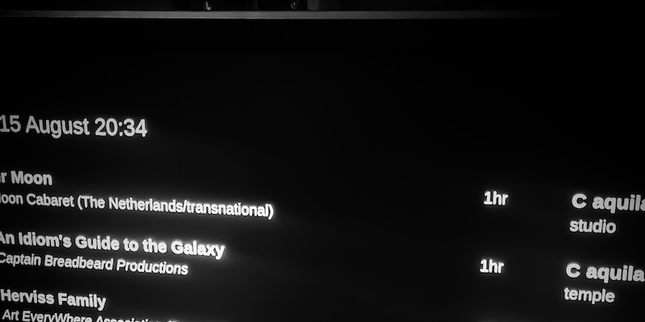

PI DISPLAY EVENTS
=================

Raspberry PI code for displaying HTML file listing events on a
monitor. The events are exported froma Google Sheets document.



### Version

The latest development version is 0.1.1 and the latest release is
[0.1.0](https://github.com/grkvlt/pi-display-events/releases/tag/version-0.1.0).

This software is provided as Open Source using the Apache 2.0 license and
is currently maintained by Andrew Kennedy.  All contributions are welcome,
including bug reports and pull requests, at the project's GitHub page.

### TODO

1. Automatic control over size of rendered page
2. Better documentation

## Install

Download the install artifacts and extract the contents, then run the
`install.sh` script as root. The target directory to install to can be
specified as the first argument to the script. If the configuration file
is to be owned by a user other than `pi` then this should be given as the
second argument.

The installation process is as follows:

```shell
$ wget https://github.com/grkvlt/pi-display-events/archive/refs/tags/version-0.1.0.tar.gz
...
$ tar zxvf version-0.1.0.tar.gz
pi-display-events-version-0.1.0/
...
$ cd pi-display-events-version-0.1.0
$ sudo ./install.sh /opt/display
...
```

Installation can take several minutes, or longer on a slow connection or
older Raspberry Pi.

### Configuration

Configure the Raspberry PI as follows:

* no screenblank
* ssh/vnc enabled

The startup script in
[`/events/events.sh`](https://github.com/grkvlt/pi-display-events/blob/main/events.sh#L41-L46)
should be edited to define the `CHROMIUM_OPTS` values to use according to
the screen size and resolution, and the specific `chromium-browser` line to
use should be uncommented.  Generally the `https://localhost/events.html`
version is best.

Edit the
[`/var/www/html/events.html`](https://github.com/grkvlt/pi-display-events/blob/main/events.html#L36-L37)
file to specify the id of the venue. This file can also be modified to
define the URLS fetched for each venue. Additionally, the alignment and
size of the events display should be altered here to better match the
screen size and resolution being used. The CSS on [line
32](https://github.com/grkvlt/pi-display-events/blob/main/events.htmlh#L32)
specifies this:

```css
transform: translate(1000px, 500px) scale(2.0, 2.0);
```

## Usage

The browser should start automatically on boot. Otherwise run the
`events.sh` script from a terminal.

```shell
$ /opt/display/events.sh
```

## Credits

The spreadsheet code that produces the HTML for displaying events was
provided by Jon Haines.

---
_Copyright 2022 by [Andrew Donald Kennedy](mailto:andrew.international@gmail.com)_ and
_Licensed under the [Apache Software License, Version 2.0](http://www.apache.org/licenses/LICENSE-2.0)_
